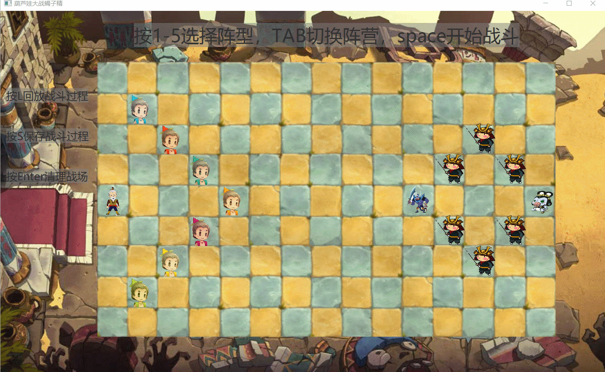
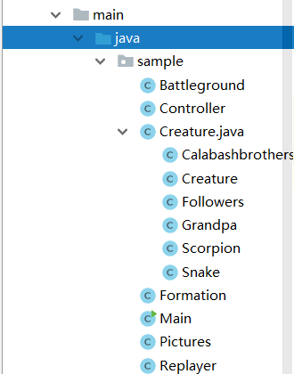

# 葫芦娃大战蝎子精
> 南京大学计算机科学与技术系 Java程序设计课程大实验
>
> 161220042 顾海阳

##  开发环境    
IntelliJ IDEA 2018.2.2    JDK 1.8  GUI Java FX  

<div>
    
</div> 

##  故事背景   

葫芦娃有七兄弟（请参考豆瓣）。红娃排行老大、橙娃排行老二、黄娃排行老三、绿娃排行老四、青娃排行老五、蓝娃排行老六、紫娃排行老七
七兄弟各有一身独特的本领。故事中还有其他主配角，包括老爷爷、蛇精、蝎子精、小喽啰等。

## 游戏设定 
1.Battleground是一个9*15的二维空间，葫芦娃老爷爷为第一阵营，蝎子精和小喽啰为第二阵营双方可以在战场上排兵布阵  
（有长蛇，鹤翼，锋矢等五个阵型供选择）  
2.按下Space键后，双方开始自由顺序移动、遇到敌人时攻击，死者留下尸体。  
3.当双方相遇时，根据彼此的运气值（讲究天时地利人和），来决定生死，留下的尸体可以无情践踏。  
4.某个阵营的生物全部阵亡后，游戏即结束。点击Enter按钮可以清理战场，进入下一局游戏的准备阶段。 
5.按下S保存，按下L加载战斗画面。

##  代码结构&设计思路
<div>
    
</div>    
        
##  1.```Creature```类  
###  天地不仁以万物为刍狗  
这是出自老子《道德经》的一句话。天地生了万物，并没有想取回什么报酬。  
所以真正意思是：天地看万物和那个丢掉的草狗一样，并没有对人特别好，对其他的万物特别差。  
也就是世间万物都有的共性。
所以```Creature```类包含了所有万物的共性包括：   
1.存活状态 isAlive   
2.编号 No （为了方便对其进行操作，本质上是万物的一种区分）  
3.所在位置  这里用（x,y）表示他们的坐标    
4.所属阵营  因为这里只有两个阵营用一个bool型来表示  
5.imageview以及image (每个生物体的图片信息，相当于相貌）  
6.```Creature```类继承了```Thread```，可以实现每一种生物都是一个线程 ，后面细讲多线程运作   
###  ```Calabashbrothers```、```Grandpa```、```Scorption```、```Snake```、```Followers```均继承自```Creature```类


## 2.```Battleground```类
###  天下如棋，一步三寸   
这里吧战场虚构成类似一个棋盘，这里根据视觉效果设计成9*15比较合理   
1.战场ground  这里定义为Creature类的二维数组 最大为9*15   
2.各种生物  相当于战场中存在的各种生物   
3.```void init()```
将整个战场初始化，将战场上的各种生物实例化。让上述所说的生物都在战场上有一席之地。


## 3.```Formation```类
###  《孙膑兵法·十阵》——凡阵有十：有方阵，有圆阵，有疏阵，有数阵，有锥行之阵，有雁行之阵，有钩行之阵，有玄襄之阵，有火阵，有水阵。  
阵法对于战场的重要性不言而喻  
这里提供的五个阵法的接口：
```
public void singlelinearry(boolean direction);  
public void heyiarry(boolean direction);  
public void yanxianarry(boolean direction);  
public void fangtongarray(boolean direction);  
public  void fengshiarray(boolean direction);  
```
其中direction 变量是指阵营方，true为葫芦娃阵营，false为蝎子精阵营;   
为了方便数组遍历 我在这初始化了个 ```Creture``` 类的Beings变量，并通过Battleground中的生物体实例化;   
此外，还设置了numbers变量（小喽啰的个数，因为其未知），根据不同的阵型来决定。   

## 4.```Pictures```方法类  
### 实质就是图片的初始载入  
```
public static ArrayList<Image> pic_creaturs = new ArrayList<>();
public static ArrayList<Image> pic_creaturs_death = new ArrayList<>();
public static Image pic_background =new Image("images/1.jpg");
```  
将图片信息初始存放在两个```Image```类的```ArrayList```中。
```
public static void initimages()
    {
        for(String x:names) {

            pic_creaturs.add(new Image("images/"+x+".png"));
            pic_creaturs_death.add(new Image("images/"+x+"death.png"));
        }
    }
```

## 5.```Replayer```类  
### 念念不忘，就看回放。  
这里的回放不是 嵌入到每一个生物体中重复执行的，我把```Replayer```类设计成了一个单独的线程类。   
通过线程的等待->执行->等待->执行来模拟回放的动画效果。   
```
public class Replayer extends Thread{
...
}
```
设置了长度1000（足够），宽度为5的二维数组Replay，来记录每一个生物的行为。  
首先是```public void getinformation(AnchorPane anchorPane)```接口来读取回放文件。  
将文件内容“翻译”到Replay中（因为保存是依据一定格式）;  
接下来Replayer线程启动：
```
public  void run()
    {
       int pcount=Creature.replaycount;//读取到的回合数
       int i=0;
       while (i<pcount) {//遍历回合数，将每一个回合都演示出来
          if(Creature.replay[i][1]==0)
              Formation.beengs[Creature.replay[i][0]].moveto(Creature.replay[i][2], Creature.replay[i][3]);
          else if(Creature.replay[i][1]==1)
          {
              Creature.replaycount=i;
              Formation.beengs[Creature.replay[i][0]].pk(Creature.replay[i][2], Creature.replay[i][3]);
          }
          try {
              sleep(200);//等待动画结束，用了个延时操作，和动画同步。
          }
          catch (InterruptedException e)
          {
              e.printStackTrace();
          }
          i++;
       }
      ...
    }
```  

## 6.接下来就是一些实现细节和特点  

### 生物体的移动  
生物体是怎么做到独立移动，依照顺序互不冲突的呢？  
我这里用到了多线程的死锁，将每一个生物体的run（）都锁住。当执行完后 再将其他存活的生物线程唤醒；  
```
  while (isalive&&!isend) {
            synchronized (a) {

                isinbattle();
              while (NO != turn) {
                    try {
                        a.wait();
                    } catch (InterruptedException e) {
                        e.printStackTrace();
                    }

                }
            ...
            }
          a.notifyAll();
}
````
怎么将生物体的移动，战斗可视化呢?  
对于生物体的移动，我这里用到了TranslateTransition动画；
```
TranslateTransition translateTransition = new TranslateTransition(Duration.millis(200),imageView);
Battleground.ground[tx][ty]=Battleground.ground[px][py];
Battleground.ground[px][py]=null;
translateTransition.setFromX(rytovy()-imageView.getLayoutX());
translateTransition.setToX(rytovy()-imageView.getLayoutX()+76*(ty-y));
translateTransition.setFromY(rxtovx()-imageView.getLayoutY());
translateTransition.setToY(rxtovx()-imageView.getLayoutY()+76*(tx-x));
```  
当有一个生物体死亡时，留下尸体，但我觉得这个要求有待商榷，因为尸体太影响战场画面，其实可以优化。  

##  7.Maven  
Maven是一个项目管理工具，它包含了一个项目对象模型 (Project Object Model)，一组标准集合，  
一个项目生命周期(Project Lifecycle)，一个依赖管理系统(Dependency Management System)，和用来运行定义在生命周期阶段(phase)中插件(plugin)目标(goal)的逻辑。  
当你使用Maven的时候，你用一个明确定义的项目对象模型来描述你的项目，然后Maven可以应用横切的逻辑，这些逻辑来自一组共享的（或者自定义的）插件。  
这里用到了Maven框架来管理我的项目，各种文件资源配置一目了然，并将程序packege为一个可执行的java文件，十分方便。  

## 8.单元测试应用
单元测试是一个非常好用的东西，可以结合Junit很方便地对代些码进行测试。经常进行单元测试是非常好的习惯。   
在本次实验中，我主要对我配置文件的加载、阵法布局，生物体的越界事件进行了单元测试，增加了程序的鲁棒性。   

## Summary  
这次实验也有很多的不足之处：   
本着遵循各种设计原则和设计模式的初衷，但是在实际操作中，常常会因为一些复杂情况，与它们背道而驰。   
导致面向对象非常不彻底，程序的耦合度很高，可复用性，可扩展性都很一般。可能是第一次接触完全面向对象的大实验吧。   
但我感觉收获良多，也让我对java这门语言产生了很大的兴趣，以后再面对它时，肯定会有很大进步吧。

